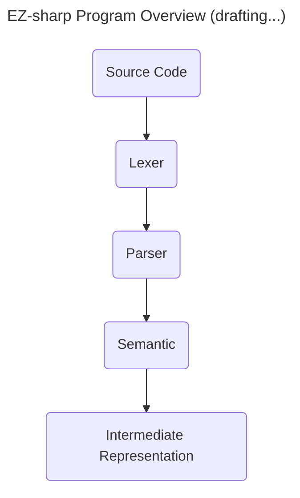

# CP471 Compiler Course

In this course, I'm gonna learn how to design and implement a compiler for a custom programming language named "EZ-Sharp" using C language. The end goal is to know about how programming languages are intepreted and converted into executable code.

## Why C over Python?

Here's few key reasons:

1. Performance: C is a low-level language that produces highly optimized machine code, making the compiler fast and efficient.
2. Minimal Runtime Overhead: C does not require a runtime environment like Python, ensuring that the compiled code can run without additional dependencies.
3. System-Level Access: C allows direct interaction with system components, such as file systems and process management, which is useful for implementing compiler optimizations and debugging tools.
4. Fine-Grained Memory Control: C provides direct memory management, which is crucial for implementing data structures like symbol tables and abstract syntax trees efficiently.
5. Historical reason: Most traditional compilers, including GCC and Clang, were written in C or C++.
6. Better Control Over Machine Code Generation: C allows fine control over generated assembly code, enabling optimizations that higher-level languages might abstract away.
7. Lightweight and Predictable Execution: Unlike Python, C does not have garbage collection or dynamic typing, ensuring predictable performance without runtime interpretation overhead.

Overall, it is surely harder to create, but it performs way better than using other languages such as Python, and it is great to challenge myself coding in C again.

## Compilation Process


## EZ-Sharp Features

EZ-Sharp is a simplified version of general purpose programming language.

Here's the EZ-Sharp grammar for reference👇

```txt
<program> ::= <fdecls> <declarations> <statement_seq>.
<fdecls> ::= <fdec>; | <fdecls> <fdec>; | ε
<fdec> ::= def <type> <fname> ( <params> ) <declarations> <statement_seq> fed
<params> ::= <type> <var> | <type> <var> , <params> | ε
<fname> ::= <id>
<declarations> ::= <decl>; | <declarations> <decl>; | ε
<decl> := <type> <varlist>
<type> := int | double
<varlist> ::= <var>, <varlist> | <var>
<statement_seq> ::= <statement> | <statement>; <statement_seq>
<statement> ::= <var> = <expr> |
				if <bexpr> then <statement_seq> fi |
				if <bexpr> then <statement_seq> else <statement_seq> fi |
				while <bexpr> do <statement_seq> od |
				print <expr> |
				return <expr> | ε
<expr> ::= <expr> + <term> | <expr> - <term> | <term>
<term> ::= <term> * <factor> | <term> / <factor> | <term> % <factor> |
<factor>
<factor> ::= <var> | <number> | (<expr>) | <fname>(<exprseq>)
<exprseq> ::= <expr>, <exprseq> | <expr> | ε
<bexpr> ::= <bexpr> or <bterm> | <bterm>
<bterm> ::= <bterm> and <bfactor> | <bfactor>
<bfactor> ::= (<bexpr>) | not <bfactor> | (<expr> <comp> <expr>)
<comp> ::= < | > | == | <= | >= | <>
<var> ::= <id> | <id>[<expr>]
<letter> ::= a | b | c | ... | z
<digit> ::= 1 | 2 | 3 | 4 | 5 | 6 | 7 | 8 | 9 | 0
<id> ::= <letter> | <id><letter> | <id><digit>
<number> ::= <integer> | <double>
```

## Phase 1: Lexical Analysis

Consider the grammar on page two. Your task in this assignment is to find the lexical
components from the grammar, and to implement lexical analysis phase of your future compiler.

Minimal implementation requirements:

- [X] Your implementation should provide lexical analysis functionality implemented as function (method) getNextToken (lexicalAnalysis function in your implementation calls getNextToken in a loop until input is over)
- [X] It should read source program from a file with “.cp” extension using Double Buffer and write the output to an error log file and a token file.
- [X] The output is a sequence of tokens recognized by your analyser and another file which states the line number and character where error has occurred.
- [X] Lexical error should not prevent your code from completing analysis. That is, you have to implement Panic Mode.
- [X] You can either create your transition tables or you can write functions to simulate regular expressions. Your transition tables can be generated manually.

### Transition Diagram Overview


### Transition Table Overview


> Note 1: First column represents 29 states (non-final and final states), including start state (0).
>
> Note 2: First header row represents ascii code from 0 to 127.
> 
> Note 3: The value represents the next state after encountering specific character.

### Test Cases + Outputs

I would only show two test cases and their related outputs where Test 0 contains lexical error and Test 1 contains no lexical error.

> Note 1: Lexer should always output a token-lexeme pairs file (token_lexeme_pairs.txt) and an error-log file (lexical_analysis_errors.txt), which used as an input for upcoming parser.
> 
> Note 2: token-lexeme pairs show a list of token-lexeme pairs, where first column represent the token type in integer and second column represent the attribute value of the token.

#### Test 0: contains lexical errors

Test0.cp

```
int x,i;
x=0;i=123.4;123.4E;
while(i<10.1Ea) do
	x = x+i*i; i=i+1
od;
print(x);.
```

token_lexeme_pairs.txt

```
22 int
23
21 x
5
21 i
10
23
21 x
12
19
10
21 i
12
20
10
10
23
22 while
6
21 i
13
21 a
7
23
22 do
23
21 x
23
12
23
21 x
0
21 i
2
21 i
10
23
21 i
12
21 i
0
19
23
22 od
10
23
22 print
6
21 x
7
10
11
```

lexical_analysis_errors.txt

```
Lexical Error: Unexpected character ';' at line 2, column 19!
Lexical Error: Unexpected character 'a' at line 3, column 14!
```


#### Test 1: no lexical errors

Test1.cp

```
int x,i;
x=0;i=1;
while(i<10) do
	x = x+i*i; i=i+1
od;
print(x);.
```

token_lexeme_pairs.txt

```
22 int
23
21 x
5
21 i
10
23
21 x
12
19
10
21 i
12
19
10
23
22 while
6
21 i
13
19
7
23
22 do
23
21 x
23
12
23
21 x
0
21 i
2
21 i
10
23
21 i
12
21 i
0
19
23
22 od
10
23
22 print
6
21 x
7
10
11
```

lexical_analysis_errors.txt

```
```


Reference: 
- https://github.com/juancwu/hachi-bitto 's documentation
- Compilers: Principles, Techniques, and Tools, A. V. Aho, R. Sethi and J. D. Ullman, Addison-Wesley, 2nd ed., 2006
