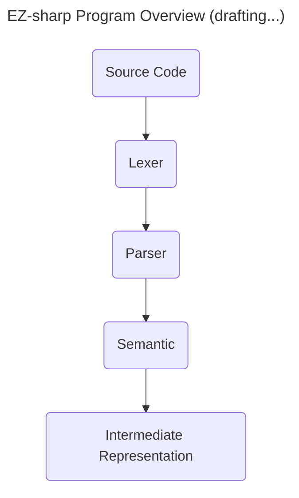

# CP471 Compiler Course

In this course, I'm gonna learn how to design and implement a compiler for a custom programming language named "EZ-Sharp" using C language. The end goal is to know about how programming languages are intepreted and converted into executable code.

## Why C over Python?

Here's few key reasons:

1. Performance: C is a low-level language that produces highly optimized machine code, making the compiler fast and efficient.
2. Minimal Runtime Overhead: C does not require a runtime environment like Python, ensuring that the compiled code can run without additional dependencies.
3. System-Level Access: C allows direct interaction with system components, such as file systems and process management, which is useful for implementing compiler optimizations and debugging tools.
4. Fine-Grained Memory Control: C provides direct memory management, which is crucial for implementing data structures like symbol tables and abstract syntax trees efficiently.
5. Historical reason: Most traditional compilers, including GCC and Clang, were written in C or C++.
6. Better Control Over Machine Code Generation: C allows fine control over generated assembly code, enabling optimizations that higher-level languages might abstract away.
7. Lightweight and Predictable Execution: Unlike Python, C does not have garbage collection or dynamic typing, ensuring predictable performance without runtime interpretation overhead.

Overall, it is surely harder to create, but it performs way better than using other languages such as Python, and it is great to challenge myself coding in C again.

## Compilation Process


## EZ-Sharp Features

EZ-Sharp is a simplified version of general purpose programming language.

Here's the EZ-Sharp grammar for reference👇

```txt
<program> ::= <fdecls> <declarations> <statement_seq>.
<fdecls> ::= <fdec>; | <fdecls> <fdec>; | ε
<fdec> ::= def <type> <fname> ( <params> ) <declarations> <statement_seq> fed
<params> ::= <type> <var> | <type> <var> , <params> | ε
<fname> ::= <id>
<declarations> ::= <decl>; | <declarations> <decl>; | ε
<decl> := <type> <varlist>
<type> := int | double
<varlist> ::= <var>, <varlist> | <var>
<statement_seq> ::= <statement> | <statement>; <statement_seq>
<statement> ::= <var> = <expr> |
				if <bexpr> then <statement_seq> fi |
				if <bexpr> then <statement_seq> else <statement_seq> fi |
				while <bexpr> do <statement_seq> od |
				print <expr> |
				return <expr> | ε
<expr> ::= <expr> + <term> | <expr> - <term> | <term>
<term> ::= <term> * <factor> | <term> / <factor> | <term> % <factor> |
<factor>
<factor> ::= <var> | <number> | (<expr>) | <fname>(<exprseq>)
<exprseq> ::= <expr>, <exprseq> | <expr> | ε
<bexpr> ::= <bexpr> or <bterm> | <bterm>
<bterm> ::= <bterm> and <bfactor> | <bfactor>
<bfactor> ::= (<bexpr>) | not <bfactor> | (<expr> <comp> <expr>)
<comp> ::= < | > | == | <= | >= | <>
<var> ::= <id> | <id>[<expr>]
<letter> ::= a | b | c | ... | z
<digit> ::= 1 | 2 | 3 | 4 | 5 | 6 | 7 | 8 | 9 | 0
<id> ::= <letter> | <id><letter> | <id><digit>
<number> ::= <integer> | <double>
```

## Phase 1: Lexical Analysis

### Transition Diagram Overview

### Transition Table Overview

### Test Cases + Their Outputs


Reference: 
- https://github.com/juancwu/hachi-bitto 's documentation
- Compilers: Principles, Techniques, and Tools, A. V. Aho, R. Sethi and J. D. Ullman, Addison-Wesley, 2nd ed., 2006
